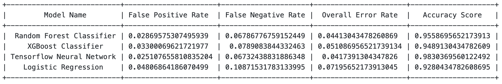

# Spam ham detection on UCI Spambase datset

In this notebook, I have fine-tuned and trained 5 classification models to identify spam-ham in UCI Spambase dataset, The models are as follows:

*   Model 1 : Random Forest Classifier - an ensemble learning method
*   Model 2 : XGBoost Classifier - an ensemble learning method
*   Model 3 : Logistic Regresion 
*   Model 4 : Neural Network in Tensorflow and Keras
*   Model 5 : Support Vector Machine

Summary of results:  

# Conclusion: 
From the results summary, we can understand that the best models are Neural Network and Random Forest Classifier. But since, the neural network has been trained for 100 epochs and the data size is just 4600 emails, there are chances of over fitting. We can also see that despite the lesser accuracy of random forest, the overall error rate of Random Forest Classifier is very close to the Neural Network.
